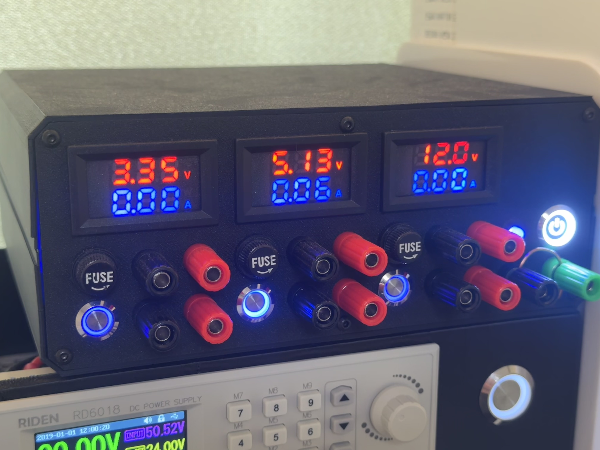
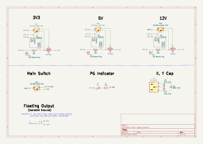

# DIY ATX Bench Power Supply

A simple bench power supply converted from a standard ATX PC power supply.  
This project is a customized version of the design by [the0neand0nly](https://www.printables.com/@the0neand0nly) featured on [Printables](https://www.printables.com/model/508450-diy-atx-lab-bench-power-supply) and [YouTube](https://youtu.be/JAnCTSZb65Y).

## Features
I modified the original design to better suit my specific needs and improve reliability:

*   **Upgraded P-Channel MOSFET:** Replaced the original IRF9540 with an **IRF4905**. This provides much lower $R_{DS(on)}$ and higher current capacity, reducing heat dissipation.
*   **Simplified LED Circuitry:** Removed the N-Channel MOSFET for the switch indicator. The switch LED is now driven directly, simplifying the internal wiring.
*   **Streamlined Interface:** Removed the USB charging ports as I personally do not use them.
*   **Floating Output Support:** Added additional **Binding Posts for Floating Output**, allowing for more flexible grounding configurations and preventing ground loops when working with sensitive test equipment.  
    **WARNING:** If you don't fully understand floating output exactly, keep the GND and Earth connected!!

## Instructions

This project is based on the excellent work by **the0neand0nly**.  
Since the basic structure is similar to the original, please refer to the original video for general assembly,  
and use my included schematic for the updated wiring details.

* **Reference Video:** [Watch on YouTube](https://youtu.be/JAnCTSZb65Y)
* **Wiring Schematic:** [SCH File](Bench_Power_Supply_SCH.pdf)

## BOM
| Component | Option | Qty | Link |
| :--- | :--- | :--- | :--- |
| Standard ATX PSU |  | 1 | |
| M430 | 10A red blue | 3 | https://a.aliexpress.com/_c3R1wijl |
| MOSFET (P-Channel) | IRF4905 | 10 * 1 | https://a.aliexpress.com/_c3f9bvvH |
| Banana Plug | Red & Black | 5 * 1 | https://a.aliexpress.com/_c3TUGccB |
| Banana Plug | 5 Color | 5 * 1  | https://a.aliexpress.com/_c3jmYU4r |
| Rocker LED switch | White,  16mm, 3-6V, Self-locking | 1 | https://a.aliexpress.com/_c3BKADwR |
| Rocker LED switch | Blue,  12mm, 12-24V, Self-locking | 1 | https://a.aliexpress.com/_c3BKADwR |
| Rocker LED switch | Blue,  12mm, 3-6V, Self-locking | 2 | https://a.aliexpress.com/_c3BKADwR |
| Fuse Holder | - | 10 * 1 | https://a.aliexpress.com/_c3Dhb6uf |
| Fuse | 5x20MM, 10A | 10 *1  |  https://a.aliexpress.com/_c4kuRLhN |
| Y Capacitor | 400VAC 2.2NF 222M | 20 * 1 |  https://a.aliexpress.com/_c3iHdzWn |
| AC Socket | - | 1 | https://a.aliexpress.com/_c4mCBQIF |

*Note: M430 above 10A require an external shunt resistor. Purchasing the 10A version is highly recommended.*

## Safety Warning
*   Working with ATX power supplies involves high voltage. Capacitors can hold a lethal charge even after the unit is unplugged.
*   Always discharge the PSU properly before opening.
*   Regarding floating Output, if you don't know what you're doing exactly, leave the GND and Earth connected!!
*   Do not exceed the rated current of your specific ATX unit.

https://www.printables.com/model/1707304-diy-atx-bench-power-supply